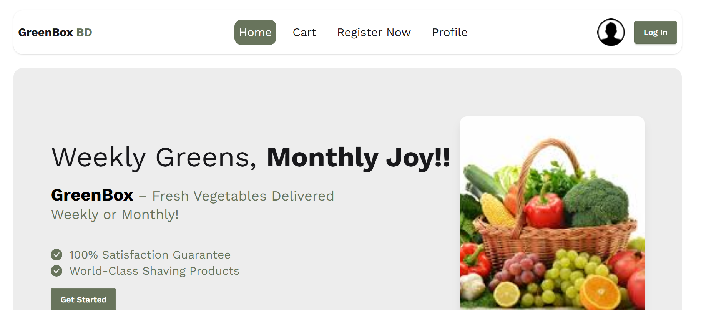

# 🥬 Green Box BD - Subscription Service Platform

Green Box BD is a subscription-based e-commerce platform designed to deliver curated vegetable boxes and related products to customers' doorsteps on a weekly or monthly basis. The platform is built using React and offers flexible plans, rich features, and a seamless shopping experience.

---

## 🔗 Live URL
[Live Site](https://greenbox-bd.web.app/) 

---

## Screenshot


---

## 🎯 Purpose
To provide a user-friendly platform where users can easily subscribe to fresh vegetable delivery boxes with flexible plans, see ratings and reviews, and manage their preferences.

---

## 🌟 Key Features
- 📦 Curated subscription boxes (Weekly, Monthly)
- 💳 Multiple pricing plans with subscription benefits
- 🖼️ SwiperJS-based featured image slider
- ⭐ Ratings and customer reviews section
- 🔐 Protected private routes
- 📝 Review submission functionality
- 🌐 Responsive and modern UI design

---

## 🧰 Tech Stack
- **Frontend:** React, Tailwind CSS  
- **Routing:** React Router  
- **Component Library:** DaisyUI + Custom Components  
- **Slider:** SwiperJS  

---

## 📦 NPM Packages Used
- react  
- react-dom  
- react-router  
- tailwindcss  
- daisyui  
- swiper  

---

## 🛠️ Local Setup Instructions

Follow these steps to run the project locally on your machine:

### Prerequisites
- [Node.js](https://nodejs.org/en/download/) installed (v14 or above recommended)
- Git installed (optional but recommended)

### Steps

```bash
# 1️⃣ Clone the repository
git clone https://github.com/mdjosimuddin198/greenboxbd-subscription-app.git
# 2️⃣ Navigate into the project directory
cd greenboxbd-subscription-app

# 3️⃣ Install dependencies
npm install

# 4️⃣ Run the development server
npm start

```
---
## 🤝 Contributing

Feel free to fork, contribute, or give feedback!

If you'd like to contribute, please follow these steps:

1. Fork the repository

2. Create your feature branch:
```bash
git checkout -b feature/YourFeature

```
3. Commit your changes:
```bash
git commit -m 'Add some feature'
```
4.Push to the branch:
```bash
git push origin feature/YourFeature
```
5. Open a Pull Request
   
Thanks for helping improve the project! 🙌
